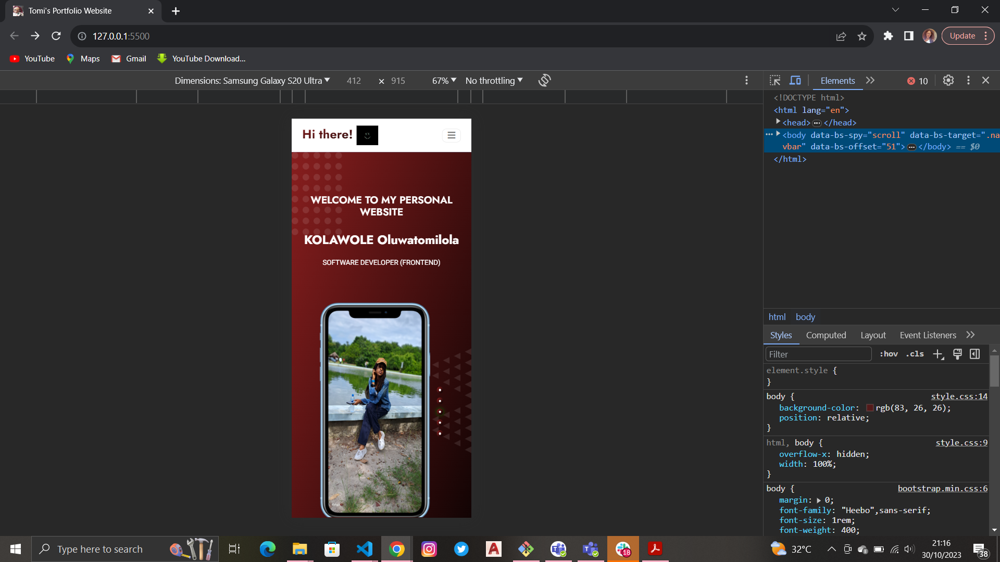
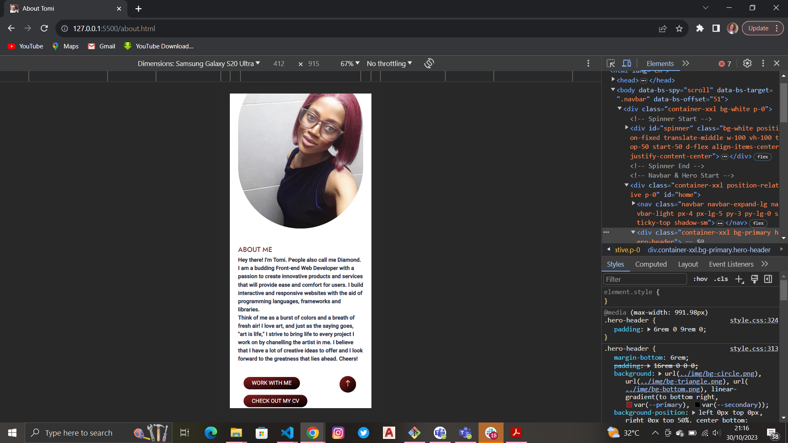
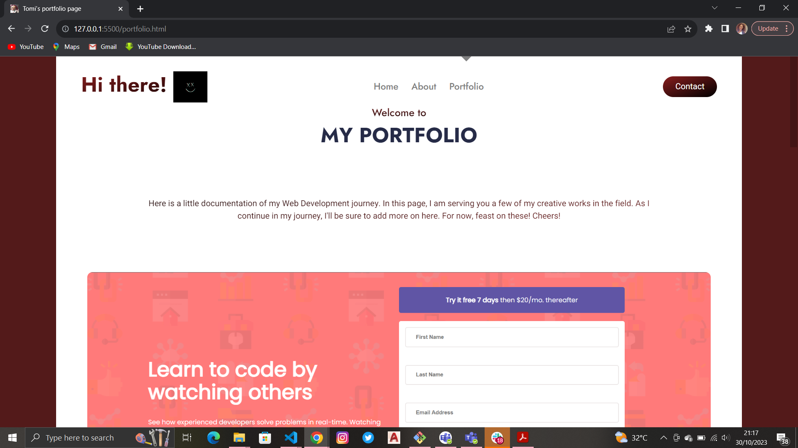
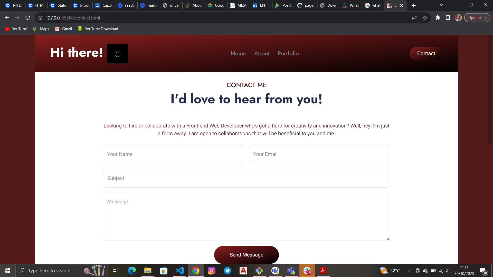

# PROJECT TITLE: 
*PERSONAL PORTFOLIO WEBSITE*

# OVERVIEW
This is my portfolio website Capstone project at Hertectrail Academy Web Development (Starter) track Cohort 7.The website showcases my background and projects as a web developer.

# CONTENTS
Home page: Read through a brief introduction, motivation and find links to my social media handles.
About page: Get more detailed information about me.
Portfolio page: Feast your eyes on some of my works and find links to their sources or pages.
Contact page: Fill out the form to get in touch with me. 

# VISUALS 

# TECHNOLOGIES USED
**HTML5** for basic *structure* 
**CSS3** for *style* implementation
**JavaScript** for website *functionality*
**Bootstrap 5.1** for website *interactiveness*

# INSTALLATION 
1. Forking
The source repository was forked from *https://github.com/PrincessMaggy/hertechtrail_cohort7_project* [repository_on_my_coach's_profile](), and then cloned into a new repository in my account using the command: git clone *https://github.com/tomithediamond/hertechtrail_cohort7_project.git*! [repository_on_my_profile]() 

2. Building
HTML, CSS, Bootstrap and JavaScript were used as building blocks for structure, style, interactivesness and functionality of this project. The work was carried out on VSCode and a live server was used to monitor progress.

3. Deployment
The website, upon completion, was deployed to Github pages. Subsequent changes are pushed to the master branch and updated on the deployed site. To view the deployed page, visit *https://tomithediamond.github.io/hertechtrail_cohort7_project/?authuser=2* [my_deployed_portfolio_website]()

# USEFUL RESOURCES 
1. *https://princessmaggy.hashnode.dev/readme-001* [guide_to_creating_a_markdown_file_by_coach_maggy]
2. HerTechTrail Academy Frontend Web Development class videos
3. *https://princessmaggy.hashnode.dev/readme-002* [_syntax_for_a_markdown_file_by_coach_maggy]

# ACKNOWLEDGEMENT 
I appreciate the efforts and investments of HerTechTrail Academy and my coach @PrincessMaggy in making my journey to becoming an entry level Front-end Web Developer successful. 

See you on my next project. :smiley: 

